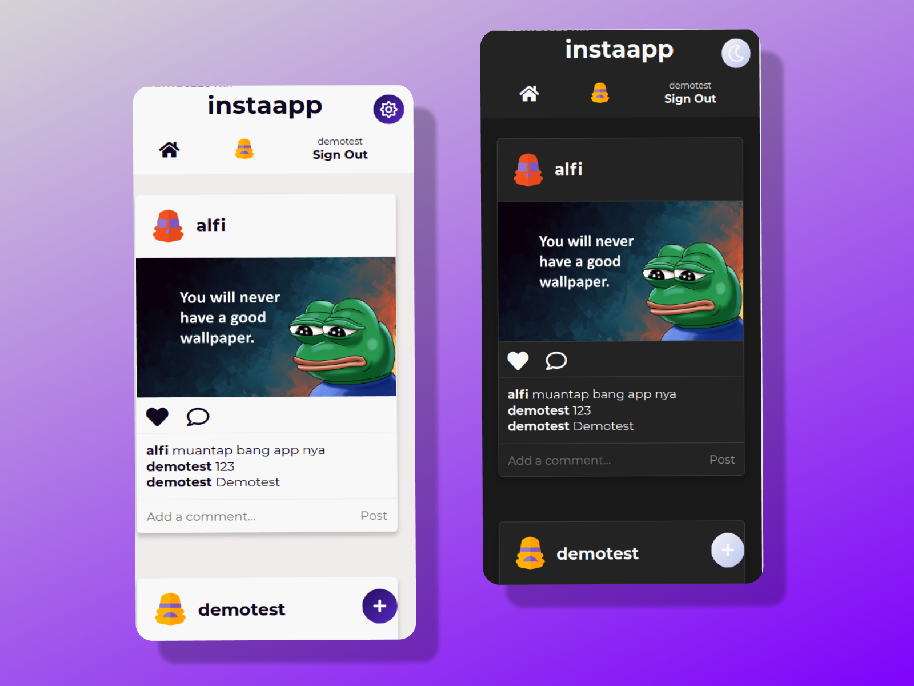

# Pixora

## 📷 Description

**Pixora** is a full-featured Instagram clone built with **React**, **Firebase**, and **ImgBB** for image hosting. Users can register, log in (via email/password or Google), upload photos with captions, like posts, and comment — just like Instagram.

This project uses:
- 🔥 Firebase for authentication and database (Firestore)
- 🌐 Imgbb for free image hosting
- 🎨 CSS Modules and custom themes
- ⚛️ React Context and Hooks for state management
- 🧩 React Router v5 for client-side routing

---

## 🚀 Demo


<br />


---

## 🛠 Installation

### 🔧 Setup

1. **Clone the repository**
   ```bash
   git clone https://github.com/RAJU3519/pixora.git
   cd pixora

